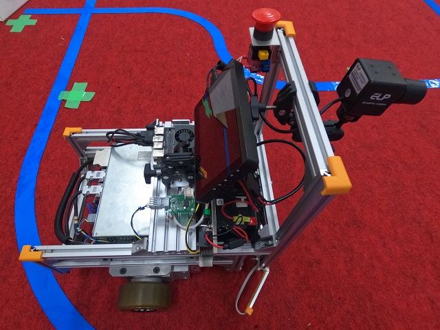

# 物体検出AIを使った台車の走行制御
物体検出AIのYOLOv5を使用した、矢印のパネルを認識し走行するソフトで、
PCのJetson Xavier NX Developer KitとモータドライバのABH3がCAN通信して走行します。<br>
実際に走行している動画を公開しています



### 1. ハード構成

種別|品名
----|----
PC|Jetson Xavier NX（Developer Kit） / Ubuntu 20.04.6 LTS
Motor Driver|ABH3 (CAN)
Motor|SWR010B-T11

### 2. ソフト構成
ソフト|バージョン
----|----
JetPack | SDK 5.1.2
torch | 2.1.0a0+41361538.nv23.6
opencv-python | 4.8.1.78


### 3. ソフト概要
必要なライブラリのインストール後に、PythonコードであるABH3_Main.py を実行することで走行制御が始まります
ソフト処理の流れは以下の通りです。

1. デバイスの設定(カメラ、CANなど)
2. キー入力受けつけ　(qを押すとソフト終了)
3. カメラから画像を取得
4. YOLOv5による物体検出 (本ソフトでは矢印パネルの検出のみ)
5. 検出した矢印パネルから目的パネルの選択と、矢印の方向を検出
6. 走行指令
7. 画面に情報出力
8. 2番へ戻りループする


### 4. ファイルについて
* ABH3_Main.py<br>
実行することで自動走行が始まるメインファイル<br>
ほかの.pyファイルはこのメインファイルから呼ばれる。

* ABH3_Camera.py<br>
カメラの設定を行う。

* ABH3_Can.py<br>
CAN通信に必要な設定と、ABH3との通信制御を行う。

* ABH3_Ctrl.py<br>
AGV動作を制御を行う。

* ABH3_Ctrl_Drive.py<br>
AGV動作の走行にかかわる制御を行う。

* ABH3_ObjDetect.py<br>
矢印パネルの選択や方向の検出を行う。

* ABH3_Paramater_AGV_AI.csv<br>
ABH3モータドライバ用のパラメータファイル
CANや走行指令のための設定が入っていて、ABH3用の通信ソフトでファイルを書き込むことで一括設定できる。

* last.pt<br>
矢印パネルを転移学習した学習データ。

* arrow.pdf<br>
矢印パネルの画像で、A4の紙に印刷することで移動の目標地点として使用できる。

### 5. YOLOv5について
AGVの目標地点として作成した矢印パネルを、YOLOv5s.ptに転移学習して物体検出しています（50枚くらい撮影して学習させました）。<br>
詳細は以下のサイトをご参照ください<br>
https://github.com/ultralytics/yolov5

### 6. ABH3について
２軸のサーボ制御をドライバ一つで行い、モータ駆動指令は走行と旋回が可能なドライバ。CAN通信に対応したモデルを使用。<br>
本ソフトに同梱している「ABH3_ParamaterForTelABH3.csv」をパラメータファイルとして書き込むことでJetsonとCAN通信して走行できる。<br>
モータはSWR010B-T11で、減速機と車輪と電断時に車軸を固定するブレーキが一体になっているモータを使用。<br>
耐荷重は500kg(駆動輪2輪、受動輪2輪（キャスターなど）の構成の場合)<br>
詳細は以下のサイトをご参照ください<br>
https://wacogiken.co.jp/

### 7.CAN通信について
JetsonはCANインターフェースが1系統ありますがCANドライバICが搭載されていないため(信号の電圧などが違う)、別途用意する必要があります。<br>
(参考URL:https://docs.nvidia.com/jetson/archives/r35.2.1/DeveloperGuide/text/HR/ControllerAreaNetworkCan.html)

### 8.Jetson Xavier NX の設定方法
JetsonXavierNXで動作させるために実際に行った手順を以下に示します<br>
最適な設定は用途により異なりますが、環境を作成する際の参考になればと思います<br>
以下の設定手順ではJetsonでLinux起動後にインターネット接続されている必要があります。（有線LANでは特に設定なしで接続できましたが、環境により異なると思います）<br>
<br>
LinuxのTerminalで実行するコマンドを以下のような枠で示しています
```
Terminalで実行するコマンド
```


1. microSDカードへ起動に必要なデータをコピーする(容量は32GB以上必要)
   1. JetPack SDK 5.1.2をNVIDIAの公式からダウンロードし解凍(jetosonXavierNX用のSDカードイメージ JP512-xnx-sd-card-image.zip)<br>
   (参考URL:https://developer.nvidia.com/embedded/jetpack-sdk-512)
   1. 解凍したsd-blob.imgをbalenaのEtcherを使いSDカードへコピー<br>
   (参考URL:https://etcher.balena.io/)
1. JetosonにSDカードを入れ起動して、Linux Ubuntuの初期設定
   1. 地域設定やキーボードを設定
   1. ユーザー名パスワード、自動ログインにして設定
   1. APP Partition Size は初期値(最大サイズ)で設定
   1. BrowerはDo not install~を選択
   1. デスクトップ画面が表示され、インターネットに接続されている場合SoftWareUpdaterが表示されますが、ここでアップデートしないほうが環境による違いが出にくいと考えます。用途に合わせDetails of updatestからSecurity updatesのみ選択するなどしてください。<br>
   Online Accounts はすべてskipやNoを選択しました
   1. 右上にあるMODE~をクリックするとPower modeを変更できます。今回はMODE 20Wの 6COREを選択します
1. AGV制御ソフトをダウンロード <br>
   1. Terminalを開く(デスクトップ、または左下のボタンで表示されるアプリケーションリストから実行、またはショートカットキーCtrl+Alt+T)<br>
   1. ソフトのダウンロード<br>
      ```bash
      git clone "https://github.com/wacogiken/abh3_agv_od"
      ```
    
1. pipのインストール
   ```bash
   sudo apt update
   sudo apt install -y python3-pip
   ```
1. JetosonのGPUに対応したpythorchとtorchvisionのインストール
   ```bash
   sudo apt install -y nvidia-jetpack」
   sudo apt install -y autoconf bc build-essential g++-8 gcc-8 clang-8 lld-8 gettext-base gfortran-8 iputils-ping libbz2-dev libc++-dev libcgal-dev libffi-dev libfreetype6-dev libhdf5-dev libjpeg-dev liblzma-dev libncurses5-dev libncursesw5-dev libpng-dev libreadline-dev libssl-dev libsqlite3-dev libxml2-dev libxslt-dev locales moreutils openssl python-openssl rsync scons python3-pip libopenblas-dev
   pip install numpy==1.24.4 scipy==1.5.3
   pip install --upgrade protobuf
   pip install --no-cache https://developer.download.nvidia.com/compute/redist/jp/v512/pytorch/torch-2.1.0a0+41361538.nv23.06-cp38-cp38-linux_aarch64.whl
   sudo apt-get install -y libjpeg-dev zlib1g-dev libpython3-dev libopenblas-dev libavcodec-dev libavformat-dev libswscale-dev
   git clone --branch release/0.16 https://github.com/pytorch/vision torchvision
   cd torchvision
   export BUILD_VERSION=0.16.1
   python3 setup.py install --user
   cd
   ```
1. OpenCVのインストール
   ```bash
   pip install python-dateutil==2.8.2
   pip install opencv-python==4.8.1.78
   ```
1. YOLOv5用の環境をインストール<br>
abh3_agv_odフォルダ内にYOLOv5のソフトをダウンロードしインストール<br>
(参考URL:https://github.com/ultralytics/yolov5)
   ```bash
   cd abh3_agv_od
   git clone https://github.com/ultralytics/yolov5
   cd yolov5
   pip install -r requirements.txt
   cd
   ```
1. CAN通信を行うためのpython-canのインストール
   ```bash
   pip install python-can
   ```
1. CANをblacklistから削除し使用可能にする<br>
管理者権限でテキストファイルにアクセスし変更する必要がある <br>
   1. 対象のファイルをテキストエディタのVimで開く<br>
      ```bash
      sudo vim /etc/modprobe.d/denylist-mttcan.conf
      ```
   1. Vimで編集する<br>
Vimは起動時にノーマルモードで立ち上がるので、「i」で挿入モードに入る。<br>
挿入モードで「blacklist mttcan」と書かれた行を「#blacklist mttcan」に書き換える(コメントアウトする)。<br>
escキーでノーマルモードに戻り「:wq」で保存終了する

1. Jetsonを再起動する
   ```
   reboot
   ```
1. CAN接続の設定(起動のたびに実行する必要あり) <br>
jetsonの入出力のピン設定、モジュールのロード、CANを接続状態にする<br>
(jetsonを起動するたびに実行する必要がある。自動的にスクリプトを実行できるようにしておくと便利)
   ```bash
   sudo busybox devmem 0x0c303010 32 0x0000C400
   sudo busybox devmem 0x0c303018 32 0x0000C458
   sudo modprobe can
   sudo modprobe can_raw
   sudo modprobe mttcan
   sudo ip link set can0 type can bitrate 250000
   sudo ip link set can0 up
   ```

1. VSCode 1.65 をインストール<br>
バージョンによって起動しない場合があったため、起動できることを確認している1.65をインストールし、updateを止める。
   ```bash
   wget https://packages.microsoft.com/repos/code/pool/main/c/code/code_1.65.2-1646922911_arm64.deb
   sudo dpkg -i code_1.65.2-1646922911_arm64.deb
   echo code hold | sudo dpkg --set-selections
   ```
1. VsCodeを開いてソフトの実行<br>
   1.VsCodeを起動
   ```bash
   code
   ```
   1. 開いたVSCode左側のExtensionsのから、Pythonをインストールする
   1. 上部FileボタンからOpneFolderをクリックしabh3_agv_odのフォルダを選択し右上のOKボタンをクリック<br>
   Do you trust~と表示されたらYes,~を選択
   1. 左側に表示されたExplorerのウィンドウからABH3_Main.pyを選択
   1. 右下の3.9.5 64-bitをクリック、上部に表示されたリストの中からPython 3.8.10 64-bit /bin/python を選択<br>
   右下の表示が3.8.10 64-bitに切り替わらない場合はVSCodeを再起動してみてください
   1. 右上にある三角形のRunPythonFileボタンを押すとABH3_Main.pyが実行されAGV制御が始まる

・VSCodeを使用しない場合<br>
以下のコマンドでソフトを実行できる
   ```bash
   cd abh3_agv_od
   python ABH3_Main.py
   ```


### 9.ライセンスについて
本ソフトに直接は含まれてはいませんが、環境構築する際にダウンロードするソフトのライセンスについて表記します
ソフト|License
----|----
YOLOv5|AGPL-3.0
PyTorch|BSD
OpenCV|BSD


